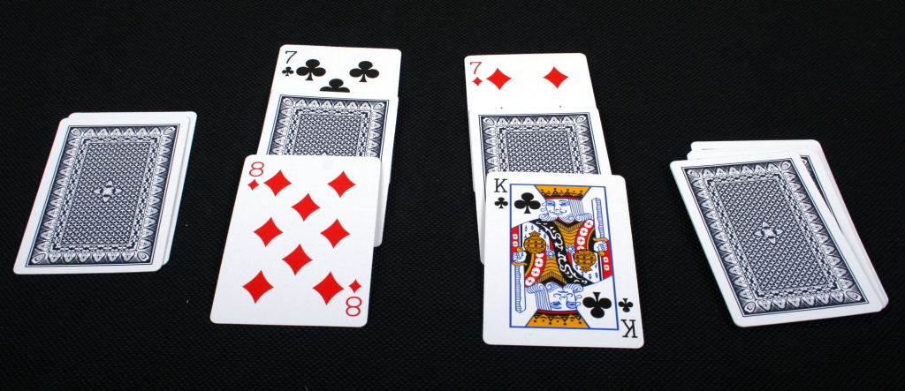
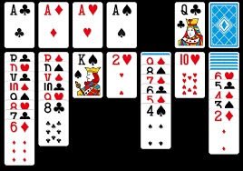

# MiniGames

<!-- TOC depthFrom:1 depthTo:6 withLinks:1 updateOnSave:1 orderedList:0 -->

- [MiniGames](#minigames)
- [1	Introduction](#1-introduction)
	- [1.1	Cadre et Description](#11-cadre-et-description)
	- [1.2	Organisation](#12-organisation)
- [2	Analyse](#2-analyse)
	- [2.1	Cahier des charges détaillé](#21-cahier-des-charges-dtaill)
	- [2.2	Stratégie de test](#22-stratgie-de-test)
		- [2.2.1	Test Unitaire](#221-test-unitaire)
		- [2.2.2	Test Performance](#222-test-performance)
		- [2.2.3	Test de Validation](#223-test-de-validation)
	- [2.3	Planification](#23-planification)
	- [2.4 Explication des jeux](#24-explication-des-jeux)
		- [2.4.1 Bataille](#241-bataille)
		- [2.4.2 Solitaire](#242-solitaire)
		- [2.4.3 Morpion / Tic-Tac-Toe](#243-morpion-tic-tac-toe)
	- [2.5 Analyse concurentiel](#25-analyse-concurentiel)
		- [2.5.1 Tic-tac-toe](#251-tic-tac-toe)
			- [2.5.1.1 Conclusion Tic-tac-toe](#2511-conclusion-tic-tac-toe)
		- [2.5.2 Le solitaire](#252-le-solitaire)
			- [2.5.2.1 Conclusion du solitaire](#2521-conclusion-du-solitaire)
		- [2.5.3 La bataille](#253-la-bataille)
- [3 Conception](#3-conception)
	- [3.1 Dossier de Conception](#31-dossier-de-conception)
	- [3.2 Maquettes graphiques](#32-maquettes-graphiques)
	- [3.3 MCD et MLD](#33-mcd-et-mld)
	- [3.4 Diagramme de classe](#34-diagramme-de-classe)
	- [3.5 Réalisation](#35-ralisation)
		- [3.5.1 Morpion](#351-morpion)
			- [3.5.1.1 Use case et Sénarios.](#3511-use-case-et-snarios)
			- [3.5.1.2 Listes des tests.](#3512-listes-des-tests)
		- [3.5.2 Bataille](#352-bataille)
			- [3.5.2.1 Use case et Sénarios.](#3521-use-case-et-snarios)
			- [3.5.2.2 Listes des tests.](#3522-listes-des-tests)
		- [3.5.3 Solitaire](#353-solitaire)
			- [3.5.3.1 Use case et Sénarios.](#3531-use-case-et-snarios)
			- [3.5.3.2 Listes des tests.](#3532-listes-des-tests)
- [4 Réalisation](#4-ralisation)

<!-- /TOC -->

# 1	Introduction
## 1.1	Cadre et Description

Ce projet consiste à développer une application en C#. Le sujet est totalement libre.

Notre application est un regroupement de mini-jeux. De base l’application contiendra trois jeux ; La bataille, le morpion et le solitaire. L’objectif est d’intégrer ces trois jeux sous forme de formulaires et si possible implémenter de nouvelles fonctionnalitées et jeux.  

## 1.2	Organisation

| Nom        | Rôle        | Mail  |
| :-------------: |:-------------:| :-----:|
|Ilan Ruiz De Porras | Eleve | Ilan.ruiz-de-porras@cpnv.ch|
|Cyril Goldenschue | Eleve | Cyrile.Goldenschue@cpnv.ch |
|Julien Ithurbide | Chef de projet | Julien.Ithurbide@cpnv.ch |
|Frederique Andolfatto | Expert | Frederique.Andolfatto@cpnv.ch |

# 2	Analyse
## 2.1	Cahier des charges détaillé

1. Nous devons travailler en binome et choisir le sujet de l'application.

2. L'application devra introduire une notion de programmation avancé tel qu'une connexion a une basse de donnée ou pouvoir communiquer sur le réseau

3. Implemantation de l'anayse et conception de l'application: Après validation du chef de projet,
rédiger un documents (markdown, docx, ...) contenant un chapitre analyse et conception. Il faut prendre le template de documentation pour application comme template de base.

4. Implemantation de l'application: Tout en implementant, rédiger les chapitres nécessaire à cette étape.

5. Phase de validation: Derrnière phase du projet qui consiste à livrer le produit final au chef de projet. Le rendu comportera:
  - l'application (tous les fichiers)
  - Documentation final contenant:
    - toutes les phase d'analyse, de conception et d'Implemantation de l'application

## 2.2	Stratégie de test

Nous ferons trois type de testes:
- Test unitaire
- Test de performance
- Test de validation.

### 2.2.1	Test Unitaire

Ces tests seront les plus fréquents et ne sont pas effectué par les testeurs. Il s’agit de testes qui déterminerons si tel et tel chose fonctionne correctement.

Exemple : tester le traitement de string, Correction du code, etc…

### 2.2.2	Test Performance

Ces tests sont effectué afin de déterminer les performances nécessaires afin de faire tourner notre application.

Ils seront simplement effectué à l’aide de l’interface de Visual studio et la vitesse d’exécution de l’application.

Ces tests montre également si l'application est optimisé ou non.

### 2.2.3	Test de Validation

Ces tests permettront de valider une fonctionnalité de l’application. Ces tests serons effectuer à l’aide d’une liste de testes à effectuer pour valider la fonctionnalité.

## 2.3	Planification

La planification se trouve sur github, dans le répertoire du projet:

[Lien du répertoire du projet](https://github.com/ICMiniGames/MiniGames)

## 2.4 Explication des jeux

### 2.4.1 Bataille

La battaile est une jeu de carte relativement basique se jouant à deux joueur.

les règles sont assez simple. On divise un paquet de 52 cartes en deux et on distribue la moitié au deux joueur. Chaqun va poser la carte se trouvant au dessus du tas et le poser face visible. le but est que votre carte sois d'une valeur supérieur a celle de votre adversaire. Celui qui aura obetenu le plus grand score gagne.

Pour plus d'information : https://fr.wikipedia.org/wiki/Bataille_(jeu)

### 2.4.2 Solitaire

Le solitaire est un jeu de carte que on retrouve sur de nombreux navigateur et il est égalmeent de base dans le systeme d'exploitation windows.

Le but est de formé ce qui s'appel des familles. Une famile est composé de toutes les cartes allant de l'as au roi du même symbole. Il s'agit d'un jeux en continue et le but est d'avoir formé toutes les familles de tous les symboles.

Pour plus d'information : https://fr.wikipedia.org/wiki/Solitaire_(patience)

### 2.4.3 Morpion / Tic-Tac-Toe

Le morpion aussi applé le Tic-Tac-Toe, est un jeux très basique se jouant a deux.

le but est de formé une ligne grâce au placement de symbole dans un plateau. le jeu se joue au tour par tour. chaque joueur placera son symbole dans une des case du plateau et ainsi de suite jusqua ce qu'une ligne se forme ou qu'il y ai aucune.

Pour plus d'information : https://fr.wikipedia.org/wiki/Tic-tac-toe

## 2.5 Analyse concurentiel

La plus part des jeux proposé par notre application se trouve sur navigateur web tel que **Chrome**. La bataille est le seul jeu de la liste n'y figurant pas.

### 2.5.1 Tic-tac-toe

il existe un tic-tac-toe sur google. il suffit simplement de tapper **tic tac toe** dans la barre de recherche google pour y accèder. il se présente sous cette forme:

Le gros avantage de cette version du tic-tac-toe est qu'il est accesible directement via navigateur. L'acces est donc direct et il n'y a pas besoin de telechargement.

La partie graphique est basic mais pour un jeu aussi simple que celui ci on a pas besoin d'un designe complex.

Une des fonctionnalité intéresante de cette version c'est la possibilité de jouer contre une inteligence artificiel. Il est meme possible de choisir le niveau de difficulté. La possibilité de jouer contre un autre joueur est aussi possible. Parcontre on ne peut pas jouer d'une machine à l'autre.

#### 2.5.1.1 Conclusion Tic-tac-toe

| Avantage | Inconvéniant |
| -------- | ------------ |
|possibilité de jouer contre un bot|besoin d'une connexion a internet pour y jouer|
|plusieur niveau de difficulté|pas de multijoueur sur réseau|
|Acces direct par navigateur| - |
|Multijoueur local| - |

Les fonctionnalité que cette version ne possède pas vont être implémenter dans notre version.

### 2.5.2 Le solitaire

Tout comme le Tic-tac-Toe, le solitaire est disponible via le moteur de recherche google et aussi via les jeux de Windows. Ici nous analyson la version de google.

Pour commencer, il est accesible directement via google donc pas besoin de telechargement pour pouvoir y jouer. Il s'agit d'une fenetre pop-up qui sert d'interface de jeu.

Le style des carte et l'interface est graphiquement épuré. c'est fluide et on a la possibilité de déplacer les cartes. Ce n'est pas just "je clique et ca apparait ou j'ai cliquer".

Le hud (Head up display) est simple et affiche le score, le nombre de déplacement et le temps que vous mettez pour finir le jeu.

Il est également possible de choisir sa difficulté. on a le choix entre facile et difficile. La différence entre les deux c'est que lorsque on pioche une carte en difficile, on en tire trois et non une.

#### 2.5.2.1 Conclusion du solitaire

| Avantage | Inconvéniant |
| -------- | ------------ |
|Choix de difficulté|une connexion a internet est requis|
|acces direct via navigateur|-|
|beau graphiquement|-|
|hud et options bien pensé|-|

Nous nous inspirons du hud de cette version et nous aurons la possibilité de pouvoir jouer en hors-ligne grace à notre version.

### 2.5.3 La bataille

Nous n'avons pas trouver d'application de jeu sur la bataille. En même temps il s'agit d'un jeu tres simpliste et le seul facteur possible pour gagner est la chance.

Nous intoduirons un systeme de paris qui n'existe pas dans le jeu de base. Nous resterons simple dans l'interface graphique et nous réspecterons les régles de cette version du jeu.

# 3 Conception
## 3.1 Dossier de Conception

## 3.2 Maquettes graphiques

Menu de l'application:

Interface du morpion:

Interface de la bataille:

Interface du solitaire:

## 3.3 MCD et MLD

MLD:

## 3.4 Diagramme de classe

## 3.5 Réalisation
### 3.5.1 Morpion

#### 3.5.1.1 Use case et Sénarios.

Action de base:

|Action|Résultat|
|-----------------|
|Le joueur 1 clique sur une case| - La case est remplacé par le symbole du joueur 1 **-** Au tour du deuxieme joueur|
|Le joueur 2 clique sur une case|- La case est remplacé par le symbole du joueur 2 **-** Au tour du joueur 1|
|Le joueur 1 clique sur une case déjà prise par le joueur 2| - Rien ne se passe **-** Le tour du joueur 1 continue tant qu'il n'a pas cliquer sur une case libre|
|Le joueur 2 clique sur une case déjà prise par le joueur 1| - Rien ne se passe **-** Le tour du joueur 2 continue tant qu'il n'a pas cliquer sur une case libre|
|Le joueur 1 clique sur une case déjà prise par lui-meme| - Rien ne se passe **-** Le tour du joueur 1 continue tant qu'il n'a pas cliquer sur une case libre|
|Le joueur 2 clique sur une case déjà prise par lui-meme| - Rien ne se passe **-** Le tour du joueur 2 continue tant qu'il n'a pas cliquer sur une case libre|

Victoire:

|Action|Résultat|
|---------------|
|Un des deux joueurs forme une ligne avec ses symboles|Le jeu s'arrete et annonce qui est le gagnant **-** Le jeu propose au joueur si il veut rejouer ou quitter.|
|Tout les case on été remplie mais pas de gagnant|Le jeu annonce qu'il y a égalité et propose de rejouer ou quitter|
|Un joueur clique sur Continuer|Le jeu recommence|
|Un joueur clique sur Quitter|Le jeu s'arrete et retour au menu|

#### 3.5.1.2 Listes des tests.

|Action|Resultat|Description suplémentaire|
|-----------------------------------------|
|Les joueurs ne peuvent pas séléctionné une case déja prise|-|-|
|Le jeu se termine quand les trois symboles sont alignés (Dans toutes les directions possible)|-|-|
|Le jeu se termine quand il y a match nul (Aucune ligne formée par les symboles)|-|-|
|Le menu de fin de partie s'affiche|-|-|
|Le choix continue remet à zéro le plateau|-|-|
|Le joueur gagnant obtient un point à son score|-|-|
|Le choix quitter le jeu ferme la fenetre du morpion|-|-|
|Le nom des joueurs est affiché vers les bords supérieur de la fenetre|-|-|
### 3.5.2 Bataille

#### 3.5.2.1 Use case et Sénarios.

#### 3.5.2.2 Listes des tests.

### 3.5.3 Solitaire

#### 3.5.3.1 Use case et Sénarios.

#### 3.5.3.2 Listes des tests.

# 4 Conclusion
